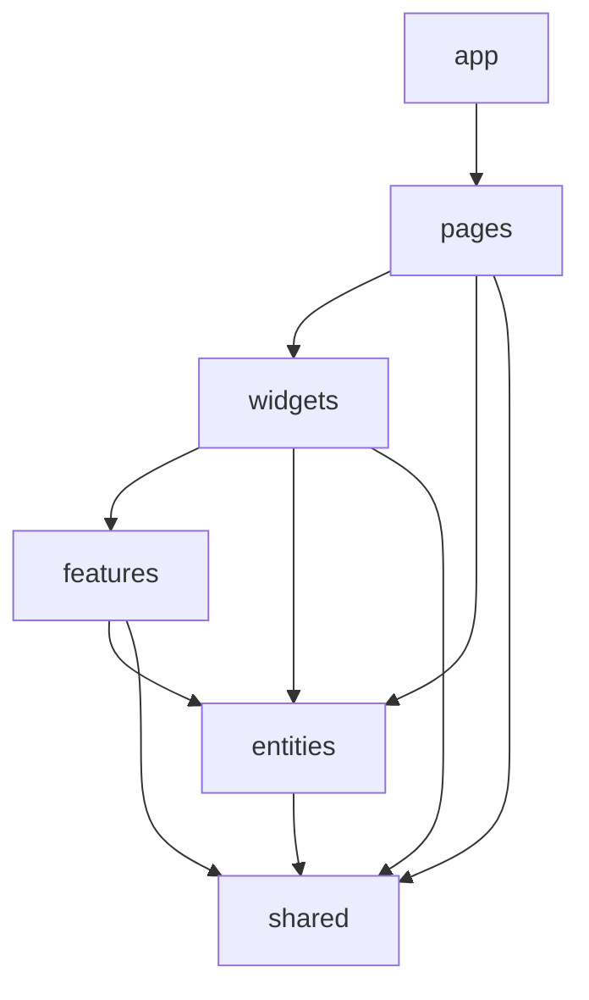

# System Patterns: AqshaTracker Project

## Architecture

### Backend
- **Monolithic Backend:** A single NestJS application serving a REST API.
- **Modular Design:** The application is structured into feature modules (e.g., `AuthModule`, `TransactionModule`) following NestJS conventions.
- **Database Interaction:** Centralized through a global `PrismaModule` and `PrismaService` using Prisma ORM.

### Frontend
- **Feature Sliced Design (FSD):** Architecture that organizes code into layers and slices.
- **Next.js Application:** Built with Next.js App Router and React.
- **Modular Components:** Reusable UI components with well-defined props and styling.
- **Internationalization:** Multi-language support with locale-based routing.

## Key Technical Decisions

### Backend
- **Framework:** NestJS (TypeScript).
- **Database:** PostgreSQL.
- **ORM:** Prisma.
- **Authentication:** JWT (JSON Web Tokens) managed by Passport.js (`passport-jwt` strategy).
- **Password Hashing:** `bcrypt`.
- **Validation:** `zod` via `nestjs-zod` integration for DTOs.
- **API Documentation:** Swagger (`@nestjs/swagger`).
- **Configuration:** Environment variables managed by `@nestjs/config`.

### Frontend
- **Framework:** Next.js with App Router (React).
- **Styling:** Tailwind CSS with custom theme variables.
- **State Management:** Zustand for global state.
- **Animation:** Framer Motion for component animations.
- **Internationalization:** Custom i18n implementation with locale detection.
- **Visualization:** Recharts for data visualization.
- **Theme Switching:** next-themes for theme management.
- **API Client:** Custom API client with fetch wrapper.

## Frontend Architecture (Feature Sliced Design)



### Layers Explanation
- **app:** Application initialization, global providers, styles, and configuration
- **pages:** Pages/screens that correspond to routes in the application
- **widgets:** Complex, composite blocks, used within pages
- **features:** User interactions that implement business logic
- **entities:** Business entities and their operations
- **shared:** Reusable infrastructure code (UI, API, utils, etc.)

### Segments in Each Layer
Each layer can have these segments:
- **ui:** UI components
- **model:** Business logic (store, state)
- **api:** API interactions
- **lib:** Utils/helpers
- **config:** Constants, configuration

## Component Relationships (High-Level)

### Backend

```mermaid
flowchart TD
    Client[Client Application] -->|HTTP Request| API{REST API Gateway}

    subgraph Backend [Backend (NestJS Application)]
        API --> Controller
        Controller -->|Uses| Service
        Service -->|Uses| PrismaService[PrismaService]
        Controller -->|Uses DTOs with| ZodValidation[nestjs-zod Pipe]
        Controller -->|Protected by| JwtAuthGuard[JwtAuthGuard]
        JwtAuthGuard -->|Uses| PassportJwtStrategy[Passport JWT Strategy]
        PassportJwtStrategy -->|Uses| AuthService
    end

    PrismaService -->|Talks to| DB[(PostgreSQL Database)]
```

### Frontend

```mermaid
flowchart TD
    Browser -->|HTTP Request| NextJS[Next.js App Router]

    subgraph Frontend [Frontend (Next.js Application)]
        NextJS --> LocaleRouter[Locale Router]
        LocaleRouter --> Pages[Pages]
        
        Pages -->|Composes| Widgets[Widgets]
        Pages -->|Uses| Features[Features]
        
        Widgets -->|Composes| Components[UI Components]
        Widgets -->|Uses| Features
        
        Features -->|Uses| Entities[Entity APIs]
        Features -->|Uses| Components
        
        Entities -->|Uses| ApiClient[API Client]
        
        ApiClient -->|HTTP Request| BackendAPI[Backend API]
        
        subgraph UILayer [UI Layer]
            Components -->|Styled with| ThemeVars[Theme Variables]
            ThemeVars -->|Light/Dark| ThemeProvider[Theme Provider]
        end
    end
```

## Design Patterns

### Backend
- **Dependency Injection:** Core to NestJS.
- **Module Pattern:** Encapsulating features.
- **Service Layer:** Business logic abstraction.
- **Repository Pattern (Implicit via Prisma):** Data access abstraction.
- **Decorator Pattern:** Used extensively by NestJS (e.g., `@Controller`, `@Injectable`, `@Get`, custom decorators like `@CurrentUser`).
- **Middleware/Pipes/Guards:** Handling cross-cutting concerns (validation, authentication, logging).

### Frontend
- **Atomic Design (Partial):** Building from small components to larger compositions.
- **Feature Sliced Design:** Organizing code into layers and slices.
- **Component Composition:** Building complex UIs from smaller, reusable components.
- **Custom Hooks:** Encapsulating reusable stateful logic.
- **Provider Pattern:** Used for theme, localization, and state context.
- **Controlled Components:** For form elements and interactive components.
- **CSS-in-JS with Tailwind:** Using utility classes with custom variables. 